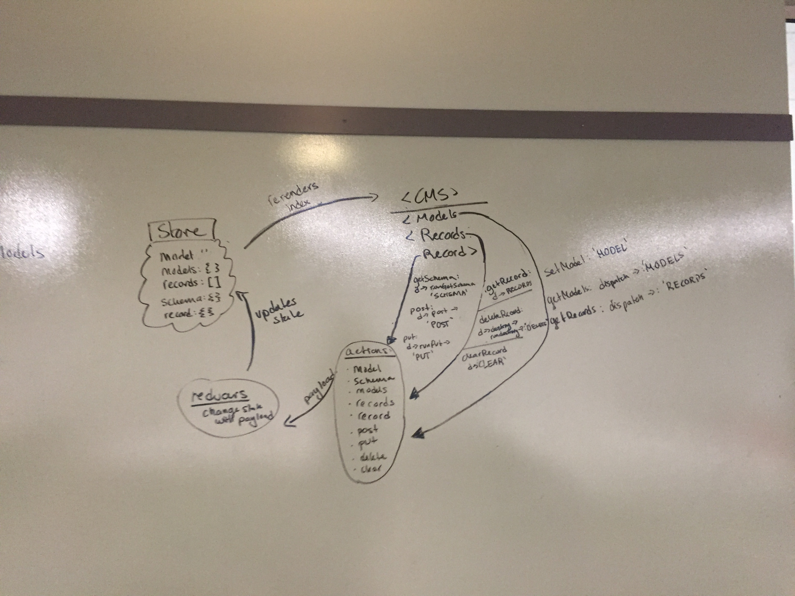

## CMS - React-Redux API Front-End

### Author: Student/Group Name

### Links and Resources
* [repo](hingham/35-project-cms-hi)
* [travis](http://xyz.com)
* [front-end](http://cms-api-lab-hi.s3-website-us-west-2.amazonaws.com/)

### Modules
#### `actions.js` 
#### `cms.js`
#### `models.js`
#### `record.js`
#### `records.js`
#### `reducers.js`

###### Usage Notes
* Forms allow for crud opperation on a data base
* schemas: players, teams, categories, and products
* Update, Add, Delete, and Read records indata base

### Setup
#### `.env` requirements
* View package.json for all depencencies
* `npm run build` to ready app for deployment

#### Running the app
* `npm start`
* Endpoint: `/`
  * Returns data about schemas
* Endpoint: `/api/v1/categories`
  * returns data and forms for categories
* Endpoint: `/api/v1/products`
  * returns data and forms for products
* Endpoint: `/api/v1/teams`
  * returns data and forms for teams
* Endpoint: `/api/v1/players`
  * returns data and forms for players

#### Tests
* `npm run tests`

#### UML
